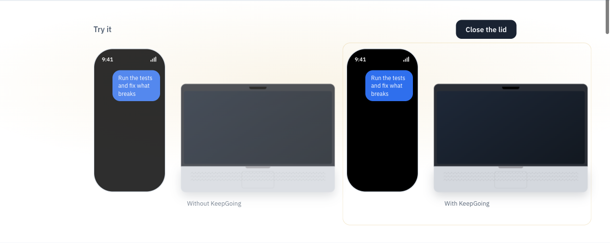

# keepgoing

Keeps your Mac awake and online while coding agents run — close the lid, control from your phone.

**https://keepgoing-pi.vercel.app**



## Install

Download [KeepGoing-0.1.1.dmg](https://github.com/bigbrainw/keepgoing/releases/download/v0.1.1/KeepGoing-0.1.1.dmg) from [Releases](https://github.com/bigbrainw/keepgoing/releases) and drag **KeepGoing.app** to **Applications**.

This build is ad-hoc signed and not yet notarised. On first open, macOS may block it:

```
xattr -d com.apple.quarantine /Applications/KeepGoing.app
```

Or right-click **KeepGoing.app** → **Open** once to approve it. Then open normally from Applications or the menu bar.

Full removal:

```
keepgoing uninstall
sudo rm /etc/sudoers.d/keepgoing   # only if you enabled lid mode
```

## The app

`KeepGoing.app` — menu bar icon. ⚡ = agents running, sleep blocked · 💤 = idle, sleep allowed · wifi-slash = offline, recovering.
Menu: agents / sleep / network / hotspot state, **Always keep awake**, **Turn off screen when idle**, **Set hotspot…** (SSID + password → Keychain), restart daemon, open log, open at login.

```
./app/build.sh                      # → dist/KeepGoing.app (Swift UI + bundled Go daemon)
cp -R dist/KeepGoing.app ~/Applications/ && open ~/Applications/KeepGoing.app
```

First launch installs the launchd daemon from the bundled `keepgoing-cli` if it isn't registered.
CLI-only use works too:

```
keepgoing install            # launchd: runs at login, restarts if it dies
keepgoing hotspot set MyiPhone   # optional: auto-join hotspot when Wi-Fi is gone
keepgoing status
```

## What the daemon does

| Concern | Behaviour |
|---|---|
| Sleep | Scans processes every 5s for `claude`, `codex`, `cursor-agent`/`agent`, and the Codex `app-server` that ChatGPT.app / Codex desktop run threads in (counted while the app is open — phone remote control needs it reachable; quit the app to let the Mac sleep). Any alive → `caffeinate -ims` assertion (system sleep blocked, display may sleep). None for `-idle-grace` (5m) → released, battery back to normal. `-always` to hold unconditionally. |
| Screen | While agents run and you haven't touched the Mac for 2 min, the display sleeps (`pmset displaysleepnow`). The system stays awake. Off by default; menu → Turn off screen when idle. |
| Wi-Fi | Probes `api.anthropic.com`, `api.openai.com`, `chatgpt.com` every 3s. Offline ≥ 20s → bounce Wi-Fi radio. Still offline 45s later → `networksetup -setairportnetwork` to the configured hotspot (password from login Keychain). Alternates, 45s backoff, resets when online. |
| Tokens (optional) | Holding proxy on `127.0.0.1:7777` (HTTP) and `:7778` (CONNECT). Export the env below and requests are *parked* while offline instead of failing → no SDK retries, no re-sent context. |

Optional proxy wiring (`keepgoing env`):

```
export ANTHROPIC_BASE_URL=http://127.0.0.1:7777/anthropic   # claude code
export API_TIMEOUT_MS=3600000
export HTTPS_PROXY=http://127.0.0.1:7778 NO_PROXY=localhost,127.0.0.1,::1   # codex (wss hard-coded → CONNECT)
```

## Close the lid

By default, closing a MacBook lid puts it to sleep — agents stop and phone remote control drops. With **Keep running with lid closed** enabled (menu bar checkbox, or `keepgoing lid enable`), the daemon toggles `pmset disablesleep` together with the normal caffeinate assertion: while any agent is running, the Mac stays awake with the lid shut. Five minutes after the last agent exits, both the assertion and disablesleep are released so battery behaviour returns to normal.

One-time setup installs a sudoers drop-in at `/etc/sudoers.d/keepgoing` (admin password required). The rule is verbatim:

```
# keepgoing: let the daemon keep the Mac awake with the lid closed.
# Only these two exact commands, nothing else.
%admin ALL=(root) NOPASSWD: /usr/bin/pmset -a disablesleep 1, /usr/bin/pmset -a disablesleep 0
```

Nothing else is granted. To remove the rule after uninstalling or disabling lid mode:

```
sudo rm /etc/sudoers.d/keepgoing
```

**Heat and battery:** a closed laptop under agent load gets warm. Keep it on a hard surface, not in a bag, and prefer plugged in. On battery alone, macOS may still throttle; lid mode overrides clamshell sleep, not thermals.

## Commands

```
keepgoing install / uninstall
keepgoing status                       JSON: agents, awake, online, wifi, proxy stats
keepgoing hotspot set <SSID>           password → Keychain (service keepgoing-hotspot)
keepgoing lid enable|disable|status    keep running with the lid closed (one-time sudoers rule)
keepgoing screen off-after <seconds|0>   turn display off after idle while agents run
keepgoing daemon [flags]               foreground; -always -idle-grace 5m -no-wifi -wifi-dry-run -no-awake
keepgoing run [flags] -- <agent cmd>   optional wrapper: proxy + awake + resume-on-crash for one headless agent
keepgoing env [-agent claude|codex]
```

Bundle note: the Go binary is `keepgoing-cli` inside the .app because APFS is case-insensitive and `keepgoing` would collide with the `KeepGoing` executable.

Config: `~/.config/keepgoing/config.json` (hotspot SSID, ports, always_awake).
Log: `~/Library/Logs/keepgoing/daemon.log`.

## Verified (2026-09-14, macOS 26, Claude Code 2.1.270, Codex 0.152.1)

- Daemon: detects sessions, `pmset -g assertions` shows the caffeinate assertion, released after idle grace.
- Wi-Fi keeper: forced offline 75s → bounce at +24s, second action at +74s (dry-run), reset on online.
- Holding proxy: Claude Code forced offline 8s → 3 requests parked, released, turn completed, no error seen by agent. Codex via CONNECT tunnel: held 7s, completed.
- Wrapper resume: `kill -9` on Claude mid-task → `claude -p --continue`, remaining steps finished.

## Limits

- **Lid closed on battery without lid mode = sleep.** Enable lid mode (menu or `keepgoing lid enable`) to override clamshell sleep while agents run; it auto-releases 5 min after the last agent exits. Plugged in is still safer for heat.
- **Hotspot join needs the phone's hotspot on.** macOS can't wake it. Set iPhone → Personal Hotspot → Allow Others to Join, and Mac → Wi-Fi → Ask to join hotspots → Automatically; keepgoing's forced join is the fallback.
- `wifi_ssid` in status shows `<redacted>` on macOS 26 (system privacy), not a bug.
- Codex hold is at CONNECT time only (TLS is opaque); a drop mid-turn relies on Codex's own reconnect.
- `/_force?offline=…` is a loopback debug switch with no auth.

## Build (CLI only)

Go 1.21+. On macOS 26 with Go 1.21 use the external linker (internal linker omits `LC_UUID`):

```
go build -ldflags=-linkmode=external -o keepgoing . && codesign -s - -f keepgoing
cp keepgoing ~/.local/bin/ && keepgoing install
```

## Roadmap

- Notarised/signed .app + dmg (currently ad-hoc signed; Gatekeeper will complain on other Macs).
- Push (ntfy/Pushover) when offline > N min or hotspot join fails.
- Cursor CLI proxy adapter; Linux (`systemd-inhibit` + `nmcli`).
- brew formula; signed .app.
